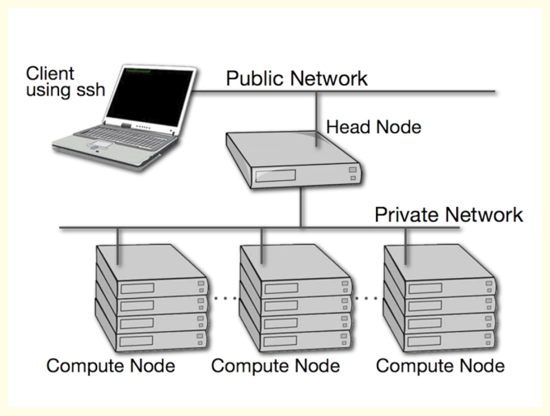

## **What is Bigdata?**
Big Data is a collection of data that is huge in volume, yet growing exponentially with time. It is a data with so large size and complexity that none of traditional data management tools can store it or process it efficiently.

## **5V's of Bigdata**
Volume: This refers to the sheer quantity of data, which is typically enormous. It can range from terabytes to petabytes and even exabytes of data. Eg:- Batch,Near Realtime,Streaming, Streams.

Velocity: This refers to the speed at which new data is generated and the speed at which data moves around. With the growth of the Internet and smart devices, data is being generated continuously, in real time, from various sources. Eg:-Structured,Unstructured,Semi Structured.

Variety: This refers to the different types of data that are now available. Big Data can include structured data (SQL databases), semi-structured data (XML, JSON), unstructured data (Word documents, JPEG images), and even complex structured data (from ERP systems or websites). Eg:-Terabytes,Records,Transactions,tables.

Veracity: This refers to the quality of the data, which can vary greatly. Veracity allows us to deal with uncertainty or imprecision, which is often an issue with many forms of big data. Eg:-Trustworthiness, Authenticity, Origin, Accountability.

Value: This is the ability to turn data into value. This is becoming the most important V of Big Data because it's important that businesses make a return on their investment in big data and data analytics. Eg:-Statistical, Events, Corelation, Hypotheticcal.

## **Examples Of BigData**
Social Media: Data from posts, likes, shares on platforms like Facebook, Twitter, Instagram.

Healthcare: Large volumes of data from electronic health records (EHRs), lab results, and patient histories.

Finance: Data from financial transactions, stock exchanges, and trading systems.

Telecommunications: Call detail records (CDRs) and network logs.

E-commerce: Data from millions of transactions daily on platforms like Amazon, eBay.

IoT: Real-time data from devices like smart homes, wearables, and industrial sensors.

Transport: Data on travel times, routes, and traffic conditions from services like Uber and Google Maps.

## **Types of Data**

1. Structured Data: This is data that adheres to a model and is easily searchable. Examples include data stored in relational databases and spreadsheets.

2. Unstructured Data: This type of data does not have a predefined model or is not organized in a pre-defined manner. Examples include text files, images, videos, emails, web pages, and social media posts.

3. Semi-Structured Data: This is a hybrid of structured and unstructured data. While it does not conform to the formal structure of data models, it contains tags or other markers to enforce hierarchy and order. Examples include JSON, XML, and email messages with both defined fields and free-form text.

## **What is a cluster**
A cluster, in the context of computing, refers to a group of computers or servers that work together and can be viewed as a single system. These computers, known as nodes, interact with each other to accomplish a common goal. This setup is used to improve performance and availability over that provided by a single computer, while typically being much more cost-effective and scalable than a single computer of comparable speed or availability.

## **Vertical Scaling**

Vertical Scaling, also known as scaling up, involves increasing the capacity of a single server, such as using a more powerful CPU, adding more RAM, or increasing disk space.

## **Horizontal Scaling**

Horizontal Scaling, also known as scaling out, involves adding more servers to a system and distributing the load across multiple servers. 

