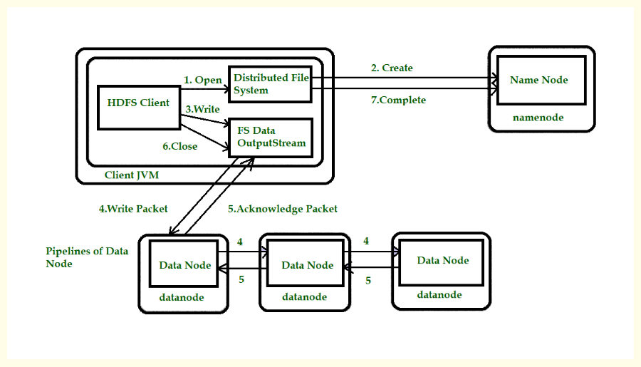
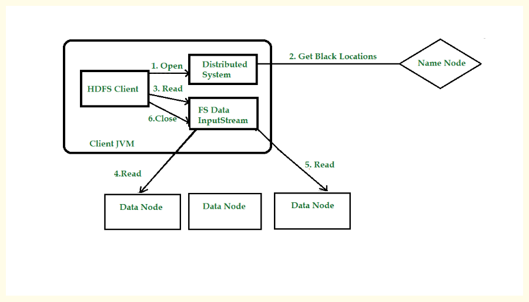

Hadoop incorporates robust features for fault tolerance and high availability to ensure the reliability and continuous operation of the cluster. These two concepts, while related to system resilience, address different aspects of failure within the Hadoop ecosystem.

### Hadoop Fault Tolerance

Fault tolerance in Hadoop primarily addresses what happens when a data node fails. If a data file is broken into blocks and stored across various data nodes, the failure of one such node could lead to the loss of a part of the file, making it unreadable. Hadoop's solution to this fundamental problem is replication. It involves creating backup copies of each data block and storing them on different data nodes. This mechanism ensures that if one copy becomes unavailable, the data can still be read from another copy.

The number of copies made for each block is determined by the replication factor, which can be configured on a file-by-file basis and even modified after a file has been created in HDFS. For instance, if a file's replication factor is set to two, HDFS automatically creates two copies of each block for that file, ensuring they are placed on different machines. Typically, the replication factor is set to three, which is considered a reasonably good level of protection, though it can be increased for files deemed super critical.

Beyond individual node failures, Hadoop also provides protection against entire rack failures through rack awareness. Without rack awareness, if all three copies of a file's block were on nodes within the same rack, an entire rack failure would lead to the loss of all copies. By configuring Hadoop for rack awareness, it ensures that at least one copy of a block is placed in a different rack, thereby protecting against such widespread failures.

The Name Node plays a crucial role in maintaining the desired replication factor. Each data node sends periodic heartbeats to the Name Node. If a data node stops sending heartbeats, the Name Node identifies it as failed. In response, the Name Node initiates the re-replication of affected blocks to restore the number of replicas to the configured factor, for example, back to three. The Name Node constantly monitors and tracks the replication factor of every block and triggers replication whenever necessary. Reasons for re-replication can include a data node becoming unavailable, a replica getting corrupted, a hard disk failing on a data node, or even a user increasing the replication factor of a file.

While replication offers robust protection against failures, it comes with a cost: increased storage consumption. Making three copies of a file effectively reduces the cluster's usable storage capacity to one-third of its raw capacity, leading to higher costs. To mitigate this, Hadoop 2.x introduced storage policies, and Hadoop 3.x offers Erasure Coding as an alternative to traditional replication. Despite these alternatives, replication remains the conventional method for fault avoidance, and its costs are generally manageable because disks are relatively inexpensive.

### Hadoop High Availability

High availability refers to the uptime of a system, representing the percentage of time a service is operational. Enterprises typically aim for extremely high uptime, such as 99.999%, for their critical systems. It's important to distinguish high availability from fault tolerance: while data node, disk, or even rack failures, as discussed in fault tolerance, do not typically bring down the *entire* Hadoop cluster, high availability specifically addresses faults that would render the entire system unusable. The cluster, as a whole, usually remains available during data-related faults, with replication handling the underlying data protection.

The primary single point of failure in a Hadoop cluster is the Name Node. The Name Node is responsible for maintaining the file system namespace, including the list of directories and files, and managing the mapping of files to their blocks. Every client interaction with the Hadoop cluster begins with the Name Node. Consequently, if the Name Node fails, the entire Hadoop cluster becomes unusable, preventing any read or write operations. Therefore, protecting against Name Node failures is essential to achieve high availability for a Hadoop cluster.

The fundamental solution to protect against any failure is a backup. For the Name Node, this involves two key aspects: backing up all the HDFS namespace information that the Name Node maintains and having a standby Name Node machine readily available to take over its role quickly.

The Name Node maintains the complete file system in its memory as an in-memory FS image. Additionally, it keeps an edit log on its local disk, which records every change made to the file system like a journal. Because the in-memory FS image can be reconstructed from the edit log, backing up the Name Node's edit log is crucial. The recommended solution for backing up the edit log in Hadoop 2.x is the Quorum Journal Manager (QJM). The QJM consists of at least three machines, each running a lightweight Journal Node daemon. Instead of writing edit log entries to its local disk, the Name Node is configured to write them to the QJM. Utilizing three Journal Nodes provides double protection for the critical edit log, and for even higher protection, a QJM can consist of five or seven nodes.

A separate machine is added to the cluster and configured as a Standby Name Node. This Standby Name Node is set up to continuously read the edit log from the QJM, ensuring it stays updated with the latest file system changes. This configuration enables the Standby Name Node to assume the active Name Node role within a few seconds. Furthermore, all data nodes are configured to send their block reports (health information for blocks) to both the Active and Standby Name Nodes.

The mechanism by which the Standby Name Node determines that the Active Name Node has failed and should take over is managed by Zookeeper and Failover Controllers. A Failover Controller runs on each Name Node. The Failover Controller on the active Name Node maintains a lock in Zookeeper, while the Standby Name Node's Failover Controller continuously attempts to acquire this lock. If the Active Name Node fails or crashes, the lock it held in Zookeeper expires. As soon as the Standby Name Node successfully acquires the lock, it recognizes that the active Name Node has failed and proceeds to transition from its standby state to the active role.

### Secondary Name Node

It is common to confuse the Secondary Name Node with the Standby Name Node, but they serve distinct purposes. As explained, a Standby Name Node acts as a direct backup for the Name Node in case of failure. The Secondary Name Node, however, addresses a different operational concern.

When the Name Node restarts, for example, due to maintenance, it loses its in-memory FS image. It then reconstructs this image by reading the edit log. The challenge arises because the edit log grows continuously, and its size directly impacts the Name Node's restart time. A very large edit log could cause the Name Node to take an hour or more to start, which is undesirable.

The Secondary Name Node solves this problem by performing a checkpoint activity periodically, typically every hour. During a checkpoint, the Secondary Name Node performs the following steps:

1.   It reads the current edit log.

2.  It then creates the latest file system state, which is an exact copy of the in-memory FS image.

3.   This state is then saved to disk as an on-disk FS image.

4.   Once the new on-disk FS image is created, the Secondary Name Node truncates (clears) the edit log, as all the changes have been applied to the new on-disk image.

5.   For subsequent checkpoints, the Secondary Name Node reads the *previous* on-disk FS image and applies only the new changes accumulated in the edit log during the last hour. It then replaces the old on-disk FS image with the new one and truncates the edit log again.

This checkpointing process is essentially a merging of an on-disk FS image and the edit log. It is a quick process because it only deals with a limited amount of new edit logs (e.g., from the last hour), and the FS image itself is smaller compared to the cumulative edit log. The primary benefit is that when the Name Node eventually restarts, it also performs this quick checkpoint activity, reading a much smaller edit log (only from the last checkpoint) and applying it to the latest on-disk FS image, thus minimizing the restart time.

It is important to note that when a Hadoop High Availability configuration is implemented with a Standby Name Node, the Standby Name Node also performs this checkpoint activity. Consequently, in a high availability setup, a separate Secondary Name Node service is no longer required.

### Write Operation in HDFS

When a client intends to write a file into HDFS, the very first step involves the client interacting with the NameNode. The NameNode is considered the "centerpiece" of the HDFS cluster because it stores all the metadata and possesses complete information about the entire cluster's data and its slave nodes (DataNodes). Therefore, any write operation must begin with a create request sent from the client to the File System API, which then forwards it to the NameNode. The NameNode's initial role is to check for access rights to ensure that the specific user or users have permission to write to the requested path.

Once access rights are verified, the NameNode's crucial function is to provide the address of the slave (DataNode) where the client should begin writing the data directly. It's a significant point to understand that the client sends only one copy of the data. This is a key design choice because if the client were to send multiple copies (e.g., three copies for a replication factor of three), it would create significant network overhead. For instance, writing 10 TB of data would necessitate sending 30 TB over the network, which is inefficient.

After the client starts writing the data directly to the initial DataNode via an FS Data Output Stream, the replication process begins among the DataNodes themselves, not initiated by the client. This process follows a data write pipeline: once the first DataNode has received and started writing a block, it immediately starts copying that block to another DataNode. This second DataNode, upon receiving the block, in turn starts copying it to a third DataNode, and so on, until the required replication level is achieved. For example, if the replication factor is three, the block will be written to DataNode 1, then DataNode 1 will copy to DataNode 3, and DataNode 3 will copy to DataNode 7. All decisions regarding which DataNodes handle the replication are taken care of by the NameNode (the master). DataNodes are in constant communication with the NameNode and report block information.

Once the required replicas are created, an acknowledgement process takes place in reverse order. The last DataNode in the pipeline sends an acknowledgement to the second-to-last DataNode, which then sends it to the first DataNode. Finally, the first DataNode sends the ultimate acknowledgement back to the client.

An important aspect of HDFS write operations is that they occur in parallel. It's not a serialized process where block one is fully written before block two begins. While write operations are generally costly, HDFS's parallel writing prevents them from being prohibitively slow, ensuring that writing terabytes of data doesn't take days. Furthermore, HDFS is designed to automatically handle failures during writing. If any DataNode goes down while data is being written, the NameNode will immediately provide the address of another DataNode where the data can be copied, ensuring data integrity and availability.

A common question is who divides the large file into smaller blocks. The responsibility for dividing the file into smaller blocks falls to the HDFS client itself (also referred to as the Hadoop client). The user or their specific machine does not need to manually divide or specify any logic for splitting the file. The Hadoop setup itself acts as the Hadoop client, containing all the necessary APIs to perform this division automatically. You, as the user, are the client, but the actual HDFS setup on your machine acts as the 'Hadoop client' that performs the block division.

### Read Operation in HDFS

When a client wishes to read a file from HDFS, the initial and crucial step involves the client interacting with the NameNode. The NameNode is recognized as the "centerpiece" of the HDFS cluster because it is responsible for storing all the metadata related to files and their block locations across the various DataNodes. Before providing any information, the NameNode first checks for access rights to ensure that the particular user or client is authorized to read the requested file.

Once access rights are verified, the NameNode's primary role shifts to providing the specific locations of the data blocks. It will furnish the client with the addresses of the DataNodes where each block of the file is actually stored. For example, it might instruct the client to "go on slave two to read block one," "go on slave ten to read block two," and so on. A very important distinction in HDFS is that the client then directly interacts with these respective DataNodes to read the file, and the NameNode is not involved in the actual data transfer during the read process.

The reason for this direct client-DataNode interaction, bypassing the NameNode for data flow, is critical: the NameNode would become a severe bottleneck if all data had to pass through it. Considering that HDFS deals with data in the range of petabytes and operates across thousands of nodes, routing all read operations through a single NameNode would make it incredibly inefficient and slow. Therefore, the read operation itself is distributed and performed in parallel directly from the DataNodes, which significantly enhances efficiency. For instance, one client might be reading a block from DataNode One, while another client simultaneously reads a different block from DataNode Three, or even the same client reads different blocks from different DataNodes in parallel.

To ensure security during this direct interaction, the NameNode doesn't just give out DataNode addresses freely. It also provides a token to the client. This token acts like an "ID card"; the client must show this token to the DataNode for authentication before the DataNode grants access to the data. This mechanism prevents unauthorized access to the data stored on the DataNodes.

At a deeper, API level, when an end-user initiates a read operation on their client machine, a Java Virtual Machine (JVM) starts. The very first API class to come into play is the `HDFS client class`. This class sends an "open request" to the `Distributed File System API`. This `File System API` then interacts directly with the NameNode to request the block locations. After the NameNode performs its authorization and authentication checks, it provides the necessary block locations. Following this, the client uses an `FS Data Input Stream` – a standard Java API specifically adapted for Hadoop – to start directly reading the data from the DataNodes.

Finally, HDFS is designed with robust fault tolerance during read operations. If, at any point while reading data, a DataNode goes down (e.g., due to a server failure or power loss), there are no issues. The client will immediately complain to the NameNode about the problem. The NameNode, which constantly monitors its DataNodes through heartbeats, will detect that the particular slave has stopped responding. In such a scenario, the NameNode will then provide the location of another DataNode where the same block of data is available. This ensures that the client can continue reading the file seamlessly without data loss or interruption.