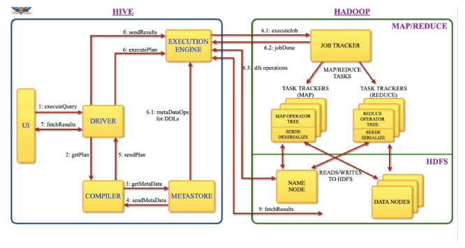

Apache Hive is an open source data warehouse system built on top of Hadoop Haused for querying and analyzing large datasets stored in Hadoop files.

Initially, you have to write complex Map-Reduce jobs, but now with the help of the Hive, you just need to submit merely SQL queries. Hive is mainly targeted towards users who are comfortable with SQL.
Hive use language called HiveQL (HQL), which is similar to SQL. HiveQL automatically translates SQL-like queries into MapReduce jobs.

Hive abstracts the complexity of Hadoop. The main thing to notice is that there is no need to learn java for Hive.
The Hive generally runs on your workstation and converts your SQL query into a series of jobs for execution on a Hadoop cluster. Apache Hive organizes data into tables. This provides a means for attaching the structure to data stored in HDFS.

### Hive Architecture

The major components of Apache Hive are:
#### Hive Client
Thrift Client: The Hive server is based on Apache Thrift so that it can serve the request from a thrift client.

JDBC Client: Hive allows for the Java applications to connect to it using the JDBC driver. JDBC driver uses Thrift to communicate with the Hive Server.

ODBC Client: Hive ODBC driver allows applications based on the ODBC protocol to connect to Hive. Similar to the JDBC driver, the ODBC driver uses Thrift to communicate with the Hive Server.

#### Hive Services
Beeline: The Beeline is a command shell supported by HiveServer2, where the user can submit its queries and command to the system. It is a JDBC client that is based on SQLLINE CLI (pure Java-console-based utility for connecting with relational databases and executing SQL queries).

Hive Server 2 : HiveServer2 is the successor of HiveServer1. HiveServer2 enables clients to execute queries against the Hive. It allows multiple clients to submit requests to Hive and retrieve the final results. It is basically designed to provide the best support for open API clients like JDBC and ODBC. Note: Hive server1, also called a Thrift server, is built on Apache Thrift protocol to handle the cross-platform communication with Hive. It allows different client applications to submit requests to Hive and retrieve the final results. It does not handle concurrent requests from more than one client due to which it was replaced by HiveServer2.

Hive Driver: The Hive driver receives the HiveQL statements submitted by the user through the command shell. It creates the session handles for the query and sends the query to the compiler.

Hive Compiler: Hive compiler parses the query. It performs semantic analysis and type-checking on the different query blocks and query expressions by using the metadata stored in metastore and generates an execution plan. The execution plan created by the compiler is the DAG(Directed Acyclic Graph), where each stage is a map/reduce job, operation on HDFS, a metadata operation.

Optimizer: Optimizer performs the transformation operations on the execution plan and splits the task to improve efficiency and scalability.

Execution Engine: Execution engine, after the compilation and optimization steps, executes the execution plan created by the compiler in order of their dependencies using Hadoop.

Metastore: Metastore is a central repository that stores the metadata information about the structure of tables and partitions, including column and column type information. It also stores information of serializer and deserializer, required for the read/write operation, and HDFS files where data is stored. This metastore is generally a relational database. Metastore provides a Thrift interface for querying and manipulating Hive metadata.

We can configure metastore in any of the two modes:
 
 1. Remote: In remote mode, metastore is a Thrift service and is useful for non-Java applications.
 
 2. Embedded: In embedded mode, the client can directly interact with the metastore using JDBC.

### Hive Query Flow

1. execututeQuery: Command Line or Web UI sends the query to the Driver (any Hive interface like database driver JDBC, ODBC, etc.) to execute the query.

2. getPlan: The driver takes the help of the query compiler which parses the query to check the syntax and the query plan or the requirement of the query.

3. getMetaData: The compiler sends a metadata request to the Metastore (any database).

4. sendMetaData: Metastore sends the metadata to the compiler in response.

5. sendPlan: The compiler checks the requirement and resends the plan to the driver. The parsing and compiling of a query is complete.

6. executePlan: The driver sends the executing plan to the execution engine.

    6.1. metaDataOps (On Hive): Meanwhile in execution, the execution engine can execute metadata operations with Metastore.

    6.2. executeJob (on Hadoop): Internally, the process of execution job is a MapReduce job. The execution engine sends the job to JobTracker, which is in the Name node and it assigns this job to TaskTracker, which is in the Data node. Here, the query executes MapReduce job.

    6.3.  job done: After the map-reduce process in Hadoop is finished, it sends a message that the process is finished here

    6.4. dfsOperations: DFS operations using the client’s reported user and group permissions and worked between Execution Engine and NameNode

7. fetchResults: The driver sends the results to Hive Interfaces.

8. sendResults: The execution engine sends those resultant values to the driver. 9.)   fetchResults: The driver sends the results to HDFS.

9. fetchResults: The driver sends the results to HDFS.

### Plain Text Data Storage vs Byte Data Storage

Plain Text Storage:

In plain text data storage, data is stored as readable characters.
For example, consider the number 12345. In plain text, it's stored as the characters '1', '2', '3', '4', and '5'.
Each character typically uses 1 byte of memory (in ASCII), or 2 bytes (in UTF-16), so this number would use 5 to 10 bytes of memory.
The advantage of plain text storage is that it's human-readable and easy to interpret without any conversion.
The disadvantage is that it's not space-efficient. Larger numbers or data types other than integers (like floating-point numbers) will use more space.

Byte (Binary) Data Storage:

In byte (or binary) data storage, data is stored as binary values, not as readable characters. Each byte consists of 8 bits, and each bit can be either 0 or 1.
Using our previous example, the number 12345 can be represented in binary format as 11000000111001, which is 14 bits or 2 bytes (with 6 unused bits). In a more memory-optimized format, it could use only the necessary 14 bits.
The advantage of binary storage is that it's very space-efficient. Each type of data (integer, float, etc.) has a standard size, regardless of its value.
The disadvantage is that binary data is not human-readable. You need to know the type of data and how it's encoded to convert it back to a readable format.

