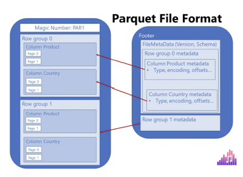
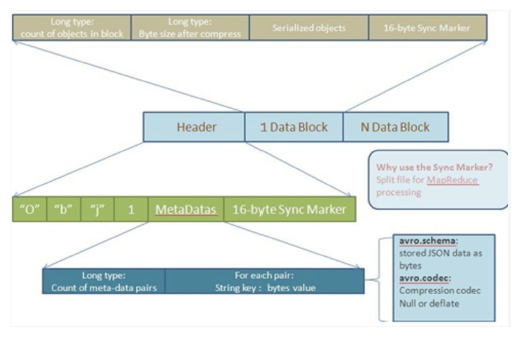

Apache Hive is an open source data warehouse system built on top of Hadoop Haused for querying and analyzing large datasets stored in Hadoop files.

Initially, you have to write complex Map-Reduce jobs, but now with the help of the Hive, you just need to submit merely SQL queries. Hive is mainly targeted towards users who are comfortable with SQL.
Hive use language called HiveQL (HQL), which is similar to SQL. HiveQL automatically translates SQL-like queries into MapReduce jobs.

Hive abstracts the complexity of Hadoop. The main thing to notice is that there is no need to learn java for Hive.
The Hive generally runs on your workstation and converts your SQL query into a series of jobs for execution on a Hadoop cluster. Apache Hive organizes data into tables. This provides a means for attaching the structure to data stored in HDFS.

### Hive Architecture

The major components of Apache Hive are:
#### Hive Client
Thrift Client: The Hive server is based on Apache Thrift so that it can serve the request from a thrift client.

JDBC Client: Hive allows for the Java applications to connect to it using the JDBC driver. JDBC driver uses Thrift to communicate with the Hive Server.

ODBC Client: Hive ODBC driver allows applications based on the ODBC protocol to connect to Hive. Similar to the JDBC driver, the ODBC driver uses Thrift to communicate with the Hive Server.

#### Hive Services
Beeline: The Beeline is a command shell supported by HiveServer2, where the user can submit its queries and command to the system. It is a JDBC client that is based on SQLLINE CLI (pure Java-console-based utility for connecting with relational databases and executing SQL queries).

Hive Server 2 : HiveServer2 is the successor of HiveServer1. HiveServer2 enables clients to execute queries against the Hive. It allows multiple clients to submit requests to Hive and retrieve the final results. It is basically designed to provide the best support for open API clients like JDBC and ODBC. Note: Hive server1, also called a Thrift server, is built on Apache Thrift protocol to handle the cross-platform communication with Hive. It allows different client applications to submit requests to Hive and retrieve the final results. It does not handle concurrent requests from more than one client due to which it was replaced by HiveServer2.

Hive Driver: The Hive driver receives the HiveQL statements submitted by the user through the command shell. It creates the session handles for the query and sends the query to the compiler.

Hive Compiler: Hive compiler parses the query. It performs semantic analysis and type-checking on the different query blocks and query expressions by using the metadata stored in metastore and generates an execution plan. The execution plan created by the compiler is the DAG(Directed Acyclic Graph), where each stage is a map/reduce job, operation on HDFS, a metadata operation.

Optimizer: Optimizer performs the transformation operations on the execution plan and splits the task to improve efficiency and scalability.

Execution Engine: Execution engine, after the compilation and optimization steps, executes the execution plan created by the compiler in order of their dependencies using Hadoop.

Metastore: Metastore is a central repository that stores the metadata information about the structure of tables and partitions, including column and column type information. It also stores information of serializer and deserializer, required for the read/write operation, and HDFS files where data is stored. This metastore is generally a relational database. Metastore provides a Thrift interface for querying and manipulating Hive metadata.

We can configure metastore in any of the two modes:
 
 1. Remote: In remote mode, metastore is a Thrift service and is useful for non-Java applications.
 
 2. Embedded: In embedded mode, the client can directly interact with the metastore using JDBC.

### Hive Query Flow

1. execututeQuery: Command Line or Web UI sends the query to the Driver (any Hive interface like database driver JDBC, ODBC, etc.) to execute the query.

2. getPlan: The driver takes the help of the query compiler which parses the query to check the syntax and the query plan or the requirement of the query.

3. getMetaData: The compiler sends a metadata request to the Metastore (any database).

4. sendMetaData: Metastore sends the metadata to the compiler in response.

5. sendPlan: The compiler checks the requirement and resends the plan to the driver. The parsing and compiling of a query is complete.

6. executePlan: The driver sends the executing plan to the execution engine.

    6.1. metaDataOps (On Hive): Meanwhile in execution, the execution engine can execute metadata operations with Metastore.

    6.2. executeJob (on Hadoop): Internally, the process of execution job is a MapReduce job. The execution engine sends the job to JobTracker, which is in the Name node and it assigns this job to TaskTracker, which is in the Data node. Here, the query executes MapReduce job.

    6.3.  job done: After the map-reduce process in Hadoop is finished, it sends a message that the process is finished here

    6.4. dfsOperations: DFS operations using the client’s reported user and group permissions and worked between Execution Engine and NameNode

7. fetchResults: The driver sends the results to Hive Interfaces.

8. sendResults: The execution engine sends those resultant values to the driver. 9.)   fetchResults: The driver sends the results to HDFS.

9. fetchResults: The driver sends the results to HDFS.

### Plain Text Data Storage vs Byte Data Storage

Plain Text Storage:

In plain text data storage, data is stored as readable characters.
For example, consider the number 12345. In plain text, it's stored as the characters '1', '2', '3', '4', and '5'.
Each character typically uses 1 byte of memory (in ASCII), or 2 bytes (in UTF-16), so this number would use 5 to 10 bytes of memory.
The advantage of plain text storage is that it's human-readable and easy to interpret without any conversion.
The disadvantage is that it's not space-efficient. Larger numbers or data types other than integers (like floating-point numbers) will use more space.

Byte (Binary) Data Storage:

In byte (or binary) data storage, data is stored as binary values, not as readable characters. Each byte consists of 8 bits, and each bit can be either 0 or 1.
Using our previous example, the number 12345 can be represented in binary format as 11000000111001, which is 14 bits or 2 bytes (with 6 unused bits). In a more memory-optimized format, it could use only the necessary 14 bits.
The advantage of binary storage is that it's very space-efficient. Each type of data (integer, float, etc.) has a standard size, regardless of its value.
The disadvantage is that binary data is not human-readable. You need to know the type of data and how it's encoded to convert it back to a readable format.

### SerDe in Hive
SerDe stands for Serializer/Deserializer.
It's a crucial component of Hive used for IO operations, specifically for reading and writing data.
It helps Hive to read data in custom formats and translate it into a format Hive can process
(deserialization) and vice versa (serialization).

Role of SerDe in Hive:
 
 1. When reading data from a table (input to Hive), deserialization is performed by the SerDe.
 
 2. When writing data to a table (output from Hive), serialization is performed by the SerDe.

Serialization - Process of converting an object in memory into bytes that can be stored in a file or transmitted over a network.

Deserialization - Process of converting the bytes back into an object in memory.

“A select statement creates deserialized data(columns) that is understood by Hive. An insert statement creates serialized data(files) that can be stored into an external storage like HDFS”.

In any table definition, there are two important sections. The “Row Format” describes the libraries used to convert a given row into columns. The “Stored as” describes the InputFormat and OutputFormat libraries used by map-reduce to read and write to HDFS files.

### File formats in Hive with SerDe Library

#### Textfile 
This is the default file format.
Each line in the text file is a record. Hive uses the LazySimpleSerDe for serialization and deserialization.
It's easy to use but doesn't provide good compression or the ability to skip over not-needed columns during read.

#### JSON
Hive supports reading and writing JSON format data.
Note that JSON files typically do not have a splittable structure, which can affect performance as only one mapper can read the data when not splittable.
Default SerDe is org.apache.hive.hcatalog.data.JsonSerDe

#### CSV
CSV is a simple, human-readable file format used to store tabular data. Columns are separated by commas, and rows by new lines.
CSV files can be read and written in Hive using the
org.apache.hadoop.hive.serde2.lazy.LazySimpleSerDe or
org.apache.hadoop.hive.serde2.OpenCSVSerde for advanced CSV parsing.
CSV lacks a splittable structure, which may affect performance due to limited parallel processing.

#### ORCFile (Optimized Row Columnar File)
Introduced by Hortonworks, ORC is a highly efficient way to store Hive data.
It provides efficient compression and encoding schemes with enhanced performance to handle complex data types.
Default SerDe is org.apache.hadoop.hive.ql.io.orc.OrcSerde

Built for the Hive query engine, ORC is a columnar storage format that allows Hive to read, write, and process data faster.
It allows for efficient compression, which saves storage space, and adds improvements in the speed of data retrieval, making it suitable for performing high-speed queries.
It stores collections of rows, not individual rows.
Each file consists of row index, column statistics, and stripes (a row of data consisting of several rows) that contain the column data.
Supports complex types: Structs, Lists, Maps, and Unions.
Also supports advanced features like bloom filters and indexing. A bloom filter is a data structure that can identify whether an element might be present in a set, or is definitely not present. In the context of ORC, bloom filters can help skip unnecessary reads when performing a lookup on a particular column value.
An ORC file contains groups of row data called stripes, along with auxiliary information in a file footer. At the end of the file a postscript holds compression parameters and the size of the compressed footer.
The default stripe size is 250 MB. Large stripe sizes enable large, efficient reads from HDFS.
The file footer contains a list of stripes in the file, the number of rows per stripe, and each column's data type. It also contains column-level aggregates count, min, max, and sum.

Strip structure:
 As shown in the diagram, each stripe in an ORC file holds index data, row data, and a stripe footer.
 ORC organizes data for each column into streams, the stripe footer records the location and size of these streams within the stripe. This allows the reader to locate and access specific parts of the stripe efficiently.
 Row data is used in table scans.
 Index data includes min and max values for each column and the row positions within each column. Row index entries provide offsets that enable seeking to the right compression block and byte within a decompressed block.  Note that ORC indexes are used only for the selection of stripes and row groups and not for answering queries.

#### Parquet
Columnar storage format, available to any project in the Hadoop ecosystem.
It's designed to bring efficient columnar storage of data compared to row-based like CSV or TSV files.
Default SerDe is org.apache.hadoop.hive.ql.io.parquet.serde.ParquetHiveSerDe

It is columnar in nature and designed to bring efficient columnar storage of data.
Provides efficient data compression and encoding schemes with enhanced performance to handle complex data in comparison to row-based files like CSV.
Schema evolution is handled in the file metadata allowing compatible schema evolution.
It supports all data types, including nested ones, and integrates well with flat data, semi-structured data, and nested data sources.
Parquet is considered a de-facto standard for storing data nowadays
Data compression – by applying various encoding and compression algorithms, Parquet file provides reduced memory consumption
Columnar storage – this is of paramount importance in analytic workloads, where fast data read operation is the key requirement. But, more on that later in the article…
Language agnostic – as already mentioned previously, developers may use different programming languages to manipulate the data in the Parquet file
Open-source format – meaning, you are not locked with a specific vendor
Support for complex data types

In traditional, row-based storage, the data is stored as a sequence of rows. Something like this:

Let’s now examine how the column store works. As you may assume, the approach is 180 degrees different:

Parquet is a columnar format that stores the data in row groups!
Wait, what?! Wasn’t it enough complicated even before this? Don’t worry, it’s much easier than it sounds:)
Let’s go back to our previous example and depict how Parquet will store this same chunk of data:

Let’s stop for a moment and explain the illustration above, as this is exactly the structure of the Parquet file (some additional things were intentionally omitted, but we will come soon to explain that as well). Columns are still stored as separate units, but Parquet introduces additional structures, called Row group.
Why is this additional structure super important?
You’ll need to wait for an answer for a bit:). In OLAP scenarios, we are mainly concerned with two concepts: projection and predicate(s). Projection refers to a SELECT statement in SQL language – which columns are needed by the query. Back to our previous example, we need only the Product and Country columns, so the engine can skip scanning the remaining ones.
Predicate(s) refer to the WHERE clause in SQL language – which rows satisfy criteria defined in the query. In our case, we are interested in T-Shirts only, so the engine can completely skip scanning Row group 2, where all the values in the Product column equal socks!

This means, every Parquet file contains “data about data” – information such as minimum and maximum values in the specific column within the certain row group. Furthermore, every Parquet file contains a footer, which keeps the information about the format version, schema information, column metadata, and so on.

#### AVRO
It's a row-oriented format that is highly splittable.
It also supports schema evolution - you can have Avro data files where each file has a different schema but all are part of the same table.
Default SerDe is org.apache.hadoop.hive.serde2.avro.AvroSerDe

Schema-Based: 
    Avro uses a schema to define the structure of the data. The schema is written in JSON and is included in the serialized data, allowing data to be self-describing and ensuring that the reader can understand the data structure without external information.

Compact and Fast: 
    Avro data is serialized in a compact binary format, which makes it highly efficient in terms of both storage and transmission.

Compression: 
    Avro supports various compression codes such as Snappy, Deflate, Bzip2, Xz
    
Schema Evolution: 
    Avro supports schema evolution, allowing the schema to change over time without breaking compatibility with old data. This is particularly useful in big data environments where data structures might evolve.

Rich Data Structures: 
    Avro supports complex data types, including nested records, arrays, maps, and unions, allowing for flexible and powerful data modelling.

Interoperability: 
    Avro is designed to work seamlessly with other big data tools and frameworks, especially within the Hadoop ecosystem, such as Apache Hive, Apache Pig, and Apache Spark.

Language Agnostic: 
    Avro has libraries for many programming languages, including Java, C, C++, Python, and more, enabling cross-language data exchange.

### ORC vs Parquet vs AVRO

  

Columnar vs Row-based: Columnar storage like Parquet and ORC is efficient for read-heavy workloads and is especially effective for queries that only access a small subset of total columns, as it allows skipping over non-relevant data quickly. Row-based storage like Avro is typically better for write-heavy workloads and for queries that access many or all columns of a table, as all of the data in a row is located next to each other.

Schema Evolution: If your data schema may change over time, Avro is a solid choice because of its support for schema evolution. Avro stores the schema and the data together, allowing you to add or remove fields over time. Parquet and ORC also support schema evolution, but with some limitations compared to Avro.

Compression: Parquet and ORC, being columnar file formats, allow for better compression and improved query performance as data of the same type is stored together. Avro also supports compression but being a row-based format, it might not be as efficient as Parquet or ORC.

Splittability: When compressed, splittable file formats can still be divided into smaller parts and processed in parallel. Parquet, ORC, and Avro are all splittable, even when compressed.

Complex Types and Nested Data: If your data includes complex nested structures, then Parquet is a good choice because it provides efficient encoding and compression of nested data.

