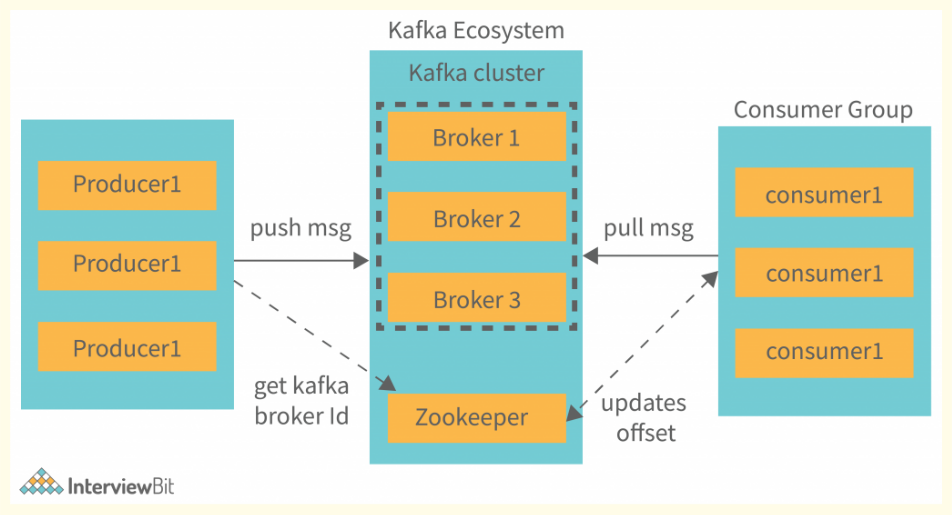

## **Kafka Architecture**

1. **Kafka Cluster** - A Kafka cluster is a system of multiple interconnected Kafka brokers (servers). These brokers cooperatively handle data distribution and ensure fault tolerance, thereby enabling efficient data processing and reliable storage.
2. **Kafka Broker** - A Kafka broker is a server in the Apache Kafka distributed system that stores and manages the data (messages). It handles requests from producers to write data, and from consumers to read data. Multiple brokers together form a Kafka cluster.
3. **Kafka Zookeeper** - Apache ZooKeeper is a service used by Kafka for cluster coordination, failover handling, and metadata management. It keeps Kafka brokers in sync, manages topic and partition information, and aids in broker failure recovery and leader election.
4. **Kafka Producer** - In Apache Kafka, a producer is an application that sends messages to Kafka topics. It handles message partitioning based on specified keys, serializes data into bytes for storage, and can receive acknowledgments upon successful message delivery. Producers also feature automatic retry mechanisms and error handling capabilities for robust data transmission.
5. **Kafka Consumer** - A Kafka consumer is an application that reads (or consumes) messages from Kafka topics. It can subscribe to one or more topics, deserializes the received byte data into a usable format, and has the capability to track its offset (the messages it has read) to manage the reading position within each partition. It can also be part of a consumer group to share the workload of reading messages.