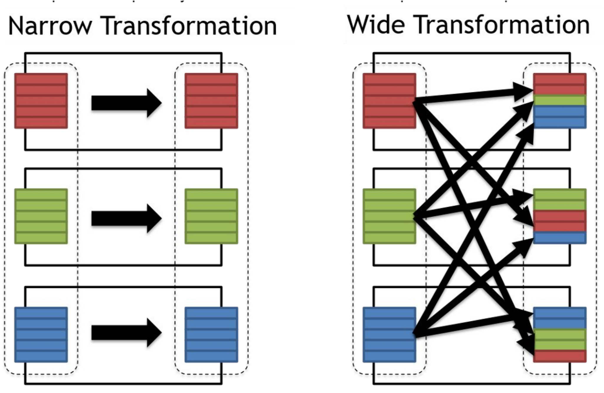

### Transformations
In Spark, a transformation is an operation applied on an RDD (Resilient Distributed Dataset) or DataFrame/Dataset to create a new RDD or DataFrame/Dataset. 

Transformations in Spark are categorized into two types: narrow and wide transformations.

#### Narrow Transformations
In these transformations, all elements that are required to compute the records in a single partition live in the same partition of the parent RDD. Data doesn't need to be shuffled across partitions.
Examples include:

1. map(): Applies a function to each element in the RDD and outputs a new RDD.
2. filter(): Creates a new RDD by selecting only the elements of the original RDD that pass a function's condition.
3. flatMap(): Function in Spark applies a function to each element of an RDD, then flattens the multiple outputs into a single 
RDD.
4. sample(): Create a sample dataset from the original data.

#### Wide Transformations
These transformations will have input data from multiple partitions. This typically involves shuffling all the data across multiple partitions. 
Examples include:

1. groupByKey(): Groups all the values of each key in the RDD into a single sequence.
2. reduceByKey(): Performs a reduction operation for each key in the RDD.
3. join(): Joins two RDDs based on a common key, similar to the SQL JOIN operation.
4. distinct(): Remove duplicates in the RDD.
5. coalesce(): Decreases the number of partitions in the RDD.
6. repartition(): Increases the number of partitions in the RDD.

### Actions
Actions in Apache Spark are operations that provide non-RDD values; they return a final value to the driver program or write data to an external system. Actions trigger the execution of the transformation operations accumulated in the Directed Acyclic Graph (DAG).

Here are some of the commonly used actions in Spark:

1. Collect: collect() returns all the elements of the RDD as an array to the driver program. This can be useful for testing and debugging, but be careful with large datasets to avoid out-of-memory errors.
2. Count: count() returns the number of elements in the RDD.
3. First: first() returns the first element of the RDD.
4. Take: take(n) returns the first n elements of the RDD.
5. foreach: foreach() is used for performing computations on each element in the RDD.
6. SaveAsTextFile: saveAsTextFile() writes the elements of the dataset to a text file (or set of text files) in a specified directory in the local filesystem, HDFS, or any other Hadoop-supported file system.
7. SaveAsSequenceFile: This action is used to save RDDs, which consist of key/value pairs, in SequenceFile format.

### Read & Write operation in Spark are Transformation/Action?
Reading and writing operations in Spark are often viewed as actions, but they're a bit unique. 
Let's clarify this:

1. Read Operation: Transformations , especially read operations can behave in two ways according to the arguments you provide:
    a. Lazily evaluated --> It will be performed only when an action is called
    b. Eagerly evaluated --> A job will be triggered to do some initial evaluations
In case of read.csv()
2. If it is called without defining the schema and inferSchema is disabled, it determines the columns as string types and it reads only the first line to determine the names (if header=True, otherwise it gives default column names) and the number of fields. 
Basically it performs a collect operation with limit 1, which means one new job is created instantly
3. Now if you specify inferSchema=True, Here above job will be triggered first as well as one more job will be triggered which will scan through entire record to determine the schema, that's why you are able to see 2 jobs in spark UI
4. Now If you specify schema explicitly by providing StructType() schema object to 'schema' argument of read.csv(), then you can see no jobs will be triggered here. This is because, we have provided the number of columns and type explicitly and catalogue of spark will store that information and now it doesn't need to scan the file to get that information and this will be validated lazily at the time of calling action
5. Write Operation: Writing or saving data in Spark, on the other hand, is considered an action. Functions like saveAsTextFile(), saveAsSequenceFile(), saveAsObjectFile(), or DataFrame write options trigger computation and result in data being written to an external system.

### Lazy Evaluation in Spark
Lazy evaluation in Spark means that the execution doesn't start until an action is triggered. In Spark, transformations are lazily evaluated, meaning that the system records how to compute the new RDD (or DataFrame/Dataset) from the existing one without performing any transformation. The transformations are only actually computed when an action is called and the data is required. 
